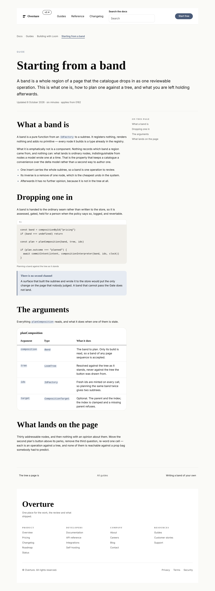
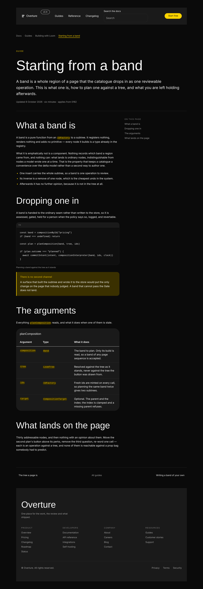



# 2026-10-08 — a page read rather than scanned

The catalogue could build one kind of page. It can now build two, and the second
one cost **no new primitive at all** — which is the most useful thing this run
has to report against a breadth mandate.

---

## What shipped

| | |
| --- | --- |
| **`DOCUMENT_PARTS` · `DOCUMENT_SEQUENCE`** | the second page sequence — five regions, no hero |
| **`trail`** | a breadcrumb under the header. **Reaches `loom.link-trail`**, the last unreached primitive waiting on work in this lane |
| **`document`** | the text: title, lede, four addressable sections of prose, code, a callout and a parameter table, with an *On this page* rail beside them |
| **`onward`** | previous, next, and the way up |
| **`nav-docs`** | a fourth design of the `nav` region. **It exists because a test refused the simpler thing** |
| `DOCUMENT_DESIGNS` · `DOCUMENT_TYPES` · `Band` | the mapping, the reach measurement, and the structural supertype that lets a document band through the ordinary seam |
| `documents.test.ts` | 23 tests, both palettes |
| **0241**, `Proposed` | `ARCHITECTURAL` — see *What I left out* |
| 4 findings | three against this lane's own primitives, one general |

`pnpm verify` is green from a deleted `dist` and `.next`: **exit 0**.

| | `main` at `bd0af3d` | this branch |
| --- | --- | --- |
| package tests (`src/`) | 174 files / **3,701** | 175 / **3,725** |
| whole package run | — | 189 files / **4,136** |
| application | — | 407 files / **7,221** |
| findings ledger | 1,056 | **1,060**, 0 malformed |
| prerender | — | 126 pages, 1,587 junctions, 0 run together |

Both package totals were measured on both trees rather than derived. **+24
tests, and only 23 of them are mine** — the twenty-fourth is generated:
`compositions.test.ts:401` mints one *renders under both starter palettes with
nothing refused* per band, so `nav-docs` arrived with the brief's rendering
test already written. **Nothing was weakened, skipped or deleted.**

**107 primitives, 60 bands, two sequences, reach 98 of 107.**

---

## One — which primitives, and why these

The brief's standing question, and this run's answer begins with a count rather
than a preference. Measured on `main` before choosing anything:

> 107 primitives · 59 bands · 22 parts · **every part has at least two designs**
> · reach 97 of 107

Three of the instruments this lane has used to choose work are therefore spent.
Designs-per-part reached zero on 5 October and was retired. Breadth against the
brief's own enumerated list — *stack, grid, container, card; badge, icon,
avatar, kbd, code; pricing, testimonials, comparison, timeline, bento, nav,
footer, CTA; marquees and canvas effects* — is **done**, and the gap inventory's
arithmetic puts the honest ceiling at 110–120 against today's 107.

So the one measurement still moving is **reach**, and reading its ten honestly
is what chose the work. Nine of the ten are not missing bands:

| | | |
| --- | --- | --- |
| `media` `embed` `lightbox` `carousel` `before-after` `overlay` `pin` | 7 | the framework's **asset seam**. Re-filed 5 and 6 October; six also fail 0233, so a bound twin is not the way round it |
| `waiting-state` | 1 | **a state this runtime is never in.** `loom.feed`'s header: resolution happens before the walk, so every binding is `ready` or `unavailable` by the time a component runs. *"Filed rather than faked"* |
| `page` | 1 | **the render root.** A band is inserted *into* a page |
| **`link-trail`** | **1** | **a breadcrumb belongs above an interior document, and there was no interior document** |

One left, and it turned out to be the same thing as a second, independent
pointer. **0183's `Alternatives considered` declined to open a second page
sequence and declined it with its trigger named:**

> **Not refused, deferred with its trigger named:** a second sequence is earned
> by a page whose *regions come in a different order*, which is **a
> documentation page or a reference**, not a shop.

A record naming a trigger and a measurement naming one gap, and they are the
same page. That is a stronger argument than any third design of a part that
already has two, and it is why this is one sequence rather than four thin bands.

### The claim this run can make that a breadth mandate most wants to hear

**A whole new kind of page needed zero new primitives.** Every node in all four
bands is a type registered before this run. That is the decomposition paying
out: 0052 was argued on reachability — *"move the second plan's button above its
perks" is unreachable against a prop bag* — and the dividend nobody had
collected is that a vocabulary carved at real joints composes into documents
nobody designed it for. A library of fat primitives would have needed
`loom.docs-page` here.

---

## Two — which fields became nodes, and which stayed props

The brief asks this directly. This run ports no Hermes block — Hermes' users are
creators and no Hermes block is reference-shaped, which is the same gap that
left `loom.code`, `loom.code-span` and `loom.kbd` registered and unreachable for
a month. So the decomposition questions are the page's rather than a content
model's, and there were four worth recording.

| | | why |
| --- | --- | --- |
| **the crumbs** | **nodes** | 0052 exactly. A `path: string[]` prop would make *this guide moved under Reference* unreachable; as four `loom.link` nodes it is a `configure` of one `href`. The last carries `current`, so the row announces where it ends |
| **the contents rail** | **nodes**, and **not a band** | one `loom.link` per entry. It is a *region* of the document band rather than a sibling of it, because `loom.page` stacks its children in one column — a region **beside** the text cannot be a band at all. That is 0051 reasoning arriving from an unusual direction |
| **the parameter table** | **nodes** | `loom.table-row` and `loom.table-cell` per row and per cell, so a delta reaches one cell. A `rows: string[][]` prop is the same mistake one level down |
| `separator` on the trail | **prop** | the near-miss, below |
| `ratio` on the split | **prop** | changes no node — the same two children either way |

**`separator` is the one worth defending, because it is the shape the
granularity doc warns about.** The test is *does changing this prop change the
set of nodes?* — and under `chevron`, `slash` and `dot` the answer is no under
every value: the same crumbs, the same links, the same order, with a different
mark drawn between them by the primitive's own stylesheet. It is
`loom.divider`'s `ornament` and it is a rendering, not a structure. The crumbs
either side of it are the nodes.

### The one that is a near-miss in the other direction, and was refused

**`contents` as a fifth region.** An *On this page* rail is a real region of a
reference page by any reading, and admitting it was the obvious move. It is
refused because it **cannot be a band**: `loom.page` lays its children out in
one column, so the rail would have had to sit above or below the text rather
than beside it, and a part that cannot occupy the region it is named for has not
identified a region. It is the `end` of a `loom.split`, which also makes it fold
under the prose on a phone for nothing.

---

## Three — the two defects a screenshot found, and the one a test found

None of the three could have been found by reading the code, and that is the
part of this run worth generalising.

### A test: the header cannot be shared, and 0168 is why

0241 was drafted with a clean two-clause decision — *a second sequence is earned
by regions in a different order, and the regions that belong to the **site**
rather than the **page** are shared between sequences.* The document sequence
would name the landing `nav` and `footer`, and a deployment editing its header
would edit it once.

The first run of `documents.test.ts` refused it in one line:

```
#top is linked and no band declares it
```

**`navBand` was doing its job.** Its four menu links were deliberately changed
from routes of a site that does not exist to **fragments of `PAGE_SEQUENCE`**
(0168), and its wordmark points at the hero's `#top`. Correct on a landing page.
Shared onto a document it is five links into bands that are not there — no
error, no diagnostic, five presses that do nothing.

So the rule has a scope nobody had had to state, because until this branch there
was one page: **a band that links into the page it is assembled into is a band
of that page kind.** The footer *is* shared — all nineteen of its links are
routes, and the test asserts object **identity** so a copy cannot creep in. The
header is a fourth design.

**And `nav-docs` had to earn that on nodes rather than on `href`s**, which is
the part that keeps the catalogue honest: `compositions.test.ts` fails two
designs of a part whose node types read the same in the same order, so a
routes-instead-of-fragments nav is a `configure` and is correctly refused. It
earns 0162's bar on a **search field** and a **version badge** — two nodes a
marketing header has no use for and a reference site is built around.

### A screenshot: the chrome was a hundred pixels inside the title

`trailBand` and `onwardBand` were written at `width: "readable"`, on the
reasoning — written into the doc comment, confidently — that a breadcrumb
belongs to the text it sits above. The wide shot showed both indented well
inside the title they bracket, because `documentBand` is `wide` and its
paragraphs take their measure from a `measured` prop further down.

Nothing could see it. Every schema passed, no diagnostic fired, and **the
overflow reading was 390 on both palettes, because a band that is too narrow is
not an overflow.** The rule the picture gives is now a test rather than three
doc comments agreeing with each other: every band of this sequence declares the
same width.

### A screenshot: the bar at 454 on a 390-pixel phone

The search field went in `loom.nav`'s `actions` region first, beside the call to
action, which is where a reader's eye expects it. `loom.field` is not at fault —
it already sets `min-width: 0` on itself for exactly the neighbouring case. The
region has no such floor: `loom.nav` sizes `brand` and `actions` by their
content, an `<input>` carries an intrinsic width, and `width: 100%` against a
parent as wide as the input wants resolves to the input. Until now the only
thing in `actions` was a link whose width is its words.

**Worked around rather than fixed**, and the workaround is the better design: as
an ordinary child it sits in the menu flow, which wraps. A way of getting
*around* a site belongs with the other ways of getting around it; `actions` is
the one thing to **do**. Filed, because the next band wanting a locale picker or
an organisation switcher at the end of a bar will meet it with no workaround
available.

A fourth thing the wide shot decided: **three menu links, not the canonical's
four.** A search field is about as wide as two links, so at four the call to
action wrapped to a second row at 1280 — the orphan a header is least able to
afford.

---

## What I left out, and why

**0241 is `Proposed` and that is the whole of what review has to settle.** It
does not contradict an `Accepted` record and supersedes nothing, but it widens
the model two of them state: 0162 says *the page is one path through it*, and
0171 reasons about *a page* throughout. This makes that two paths.

The branch is shaped so that answering it either way costs a rename:

- `COMPOSITION_PARTS` — 22, unmoved.
- `PAGE_SEQUENCE` — the landing page, unmoved.
- `STARTER_COMPOSITIONS` — the landing phrasebook, **grown by one** (`nav-docs`,
  a design of a region it already names) and not by the three document bands.
- `CATALOGUE_TYPES` — unmoved, so the out-of-lane surface that counts it reports
  what it reported yesterday.

**The thing I deliberately did not do is append the document bands to
`STARTER_COMPOSITIONS`.** It is the tidier shape and probably the right one —
0162 most naturally extends to *the phrasebook is every design of every region,
and a page kind is a path through it*. It would also mean widening
`compositions.test.ts`' *every band declares a part the page sequence knows*,
which is the guard whose class caught the duplicate-anchor defect, and changing
what a published export means for two consuming lanes. A routine does not
weaken that test to make room for its own work. `documents.test.ts` holds the
separation explicitly, with a comment saying that the test to delete when this
is settled should be deleted by a decision rather than by a diff that made a red
build go away.

**Also left:** a second design of each new part. A sequence with one design per
region is a sequence where a deployment has no choice — the same debt the
landing page paid down 9 → 5 → 1 → 0 over four runs. Recorded in 0241 rather
than discovered in a month.

### Two files outside this lane

`apps/loom/app/(docs)/_lib/api/reference.generated.json` is regenerated with
`pnpm --filter @loom/app docs:api`, which is what its own failure message
instructs; the diff is the seven new exports and nothing else.
`counts.test.ts` has one literal moved, `starter-bands: fifty-nine` → `sixty`,
which is a count the site states and the test exists to make move. Neither is
authoring in another lane.

---

## What the library still cannot express

1. **A page that is not a landing page or a document.** Two sequences now, and
   the third — a dashboard, a settings screen, an application shell — is a
   different question again, because those have chrome that persists across
   routes and nothing here models a route.
2. **Seven primitives behind the asset seam.** Unchanged and still the
   framework's. It is the single largest thing standing between this catalogue
   and a page with a picture on it.
3. **One of *n* children chosen, where the labels are in the children.** Tabs,
   the segmented control, the pricing toggle, the radio group. `ARCHITECTURAL`,
   filed by 0176, and the only Tier B group left. A reference page wants tabbed
   code samples and this is why it has none.
4. **An icon-only trigger.** 0234's leftover: a control renders its name as a
   child, so a magnifying glass has no accessible name — which is why the bar on
   this page draws the words *Search the docs*.
5. **A sidebar proportion.** `loom.split` offers 50/50, 62/38 and 38/62, and a
   contents rail wants about 75/25. Filed; the rail ships roomier than anyone
   would draw it.
6. **`search` on `loom.field`.** Two characters of enum, filed beside the
   `checkbox` label question the same enum has carried since 14 September.
7. **A guard on the landing page's own links.** `compositions.test.ts` holds
   that no two bands share an anchor and **not** that every in-page `href`
   resolves. `documents.test.ts` holds both for the new sequence; the landing
   page is currently unguarded against a renamed anchor leaving `navBand`
   pointing at nothing. Four lines in a file that already has the helpers, and
   it is the clearest piece of work this run leaves behind.

---

## The pictures

Two palettes, two widths. The sheet is `a-page-read-rather-than-scanned.specimen.ts`
and it is `DOCUMENT_SEQUENCE` verbatim, so it cannot drift from the catalogue.

| | editorial | bold |
| --- | --- | --- |
| the document, 1280 |  |  |
| on a phone |  |  |

```
prim-doc-{editorial,bold}-wide    1280x900@2x   scrollWidth 1280 / innerWidth 1280
prim-doc-{editorial,bold}-phone    390x844@2x   scrollWidth  390 / innerWidth  390
```

No horizontal overflow in any of the four, and no clipping box hiding content in
any of them either.

**The two to read at size are the bar and the left edge.** The bar is the whole
shared-chrome argument in one strip — a search field and a version badge where
the canonical has four fragments, and three links rather than four because the
field costs two. The left edge is the screenshot-found defect: the breadcrumb,
the eyebrow, the title, every paragraph, the rule above the pager and the pager
itself all start at one x. Hold a straight edge to it; that is the thing that
was wrong and that nothing but a picture was ever going to say.

**The phone shot is where the split earns its keep.** The contents rail is below
the text rather than beside it, and it is the same two nodes in the same two
regions — no second design, no media query, and nothing in the render that read
a viewport.

The filenames are abbreviated for the reason 6 October's finding gives: the
mangler that wraps a pull-request URL in injected backticks fires on length, and
the raw-content prefix is 99 characters before a filename starts. `prim-doc-…`
posts at about 125. The report keeps the long slug, whose own references are
repository-relative and have no limit.
