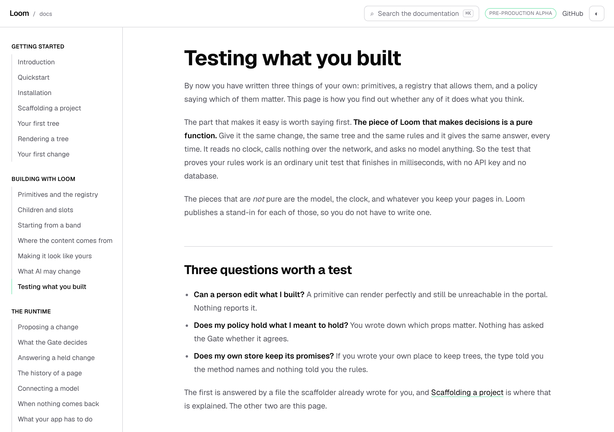
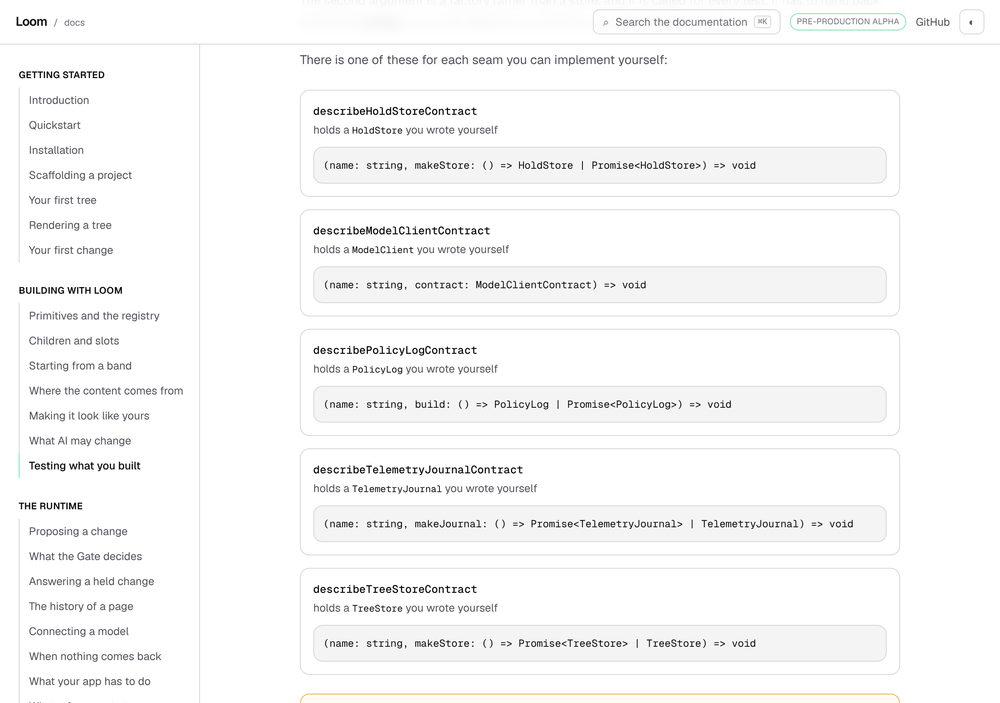

# 9 October 2026 — testing what you built, and the doors nothing explained

**Routine:** `Loom docs` · **Branch:** `docs-50-testing-what-you-built` ·
**Section:** §4c

No open pull request from this lane at the start of the run, and no maintainer
comments outstanding on any pull request of this lane's. Fresh branch off `main`
at `19e0f16`.

## What this run is

A new page, **Testing what you built**, the last one in *Building with Loom*
and the page after *What AI may change*. It is at
`apps/loom/app/(docs)/docs/building-with-loom/testing-what-you-built/page.mdx`.

The site has told a reader how to install Loom, define a primitive, register it,
compose a page, theme it, write a policy, wire a write path, connect a model,
deploy it and debug it. It has never told them how to **prove any of it**. The
exit condition for this section is a stranger getting a proposal accepted
working only from the site, and the step that turns that from a demo into a
thing they would ship is a test they trust.



## The measurement that chose the page

`_lib/api/mentions.ts` works out which written page names a given export, by
reading the pages. It was built so a generated reference page can link to the
prose that explains a name. Asked the question the other way round — *which
doors does no page name at all* — it answers in one pass, and nobody had asked
it:

| door | exports | named on some page |
| --- | --- | --- |
| `@jam-overture/loom/testing` | 54 | 1 |
| `@jam-overture/loom/testing/contracts` | 20 | **0** |
| `@jam-overture/loom/cli` | 25 | **0** |
| `@jam-overture/loom/signals/postgres` | 5 | **0** |

The whole figure is 103 of 1,416 exports named on a written page, and that is
not the alarming number: the reference is generated precisely so a thousand
signatures need not be written out, and *named on* was never a claim about
coverage. **A door with zero is a different statement**, because every path into
this site runs through prose. `describeTreeStoreContract` — a ready-made suite
that holds a host's own store to the promises Loom's two keep — was reachable
only by a reader who already knew to look for it.

`@jam-overture/loom/cli` is a false positive and is in the table on purpose: the
CLI is taught on *Scaffolding a project*, which names `loom init` rather than
any export, so a door whose surface is commands reads as unexplained.
`signals/postgres` is the one actually left, and it is its own lane's.

## What the page does

Three questions, in the order a reader hits them, and the first is answered by
pointing at *Scaffolding a project* rather than repeating it — the scaffolder already writes the registry audit and
that page already argues for it.

**The fixtures.** `sampleTree()`, the stand-ins beside it, and the one thing a
reader will get wrong: the fixture tree and the fixture registry are a pair, and
neither is for testing your own primitives.

**The policy.** The centre of the page, and the test almost nobody writes. A
pricing tree, a proposal that raises a price, and the same ask run twice under
two policies:

```
protectedPropKeys: ["price"]   → held,      "configures protected price"
no protected keys              → committed
```

The second half is the half that proves anything, and the page says so: a test
of the protected case alone passes just as well against a policy that holds
everything, which is not a policy. No model is involved in either, because
`scriptedInterpreter` hands back the proposal the test wrote.

**The contract suites.** One line in a test file of a reader's own, and their
store is held to exactly what Loom's two are held to.



That block is read off the generated reference rather than typed:
`_lib/proving/contracts.ts` finds the suites in the door by the shape of their
names, and lifts the seam each one holds out of the contract module's own
opening sentence. A sixth suite published tomorrow appears on the page with
nobody told to update anything, and a module that stops naming its seam fails a
test rather than rendering a blank cell.

| | 1280×900 | 390×844 |
| --- | --- | --- |
| page | `scrollWidth 1280 / innerWidth 1280` | `scrollWidth 390 / innerWidth 390` |
| the suites block | `768×750`, five entries | `350×750`, five entries |

The rail's mark for the new page sits at y 581 inside a box running 57 to 901,
which is yesterday's `in-view.ts` doing its job on the page that did not exist
when it was written.

## Two things the writing turned up

Both are filed, both are measurements rather than opinions, and the second one
changed what the page says.

**A diagnostic is the render's first complaint, not its list.** One
unregistered primitive holding one text node, under two roots that differ only
in their props:

| the root | diagnostics |
| --- | --- |
| `loom.page` with the props its schema wants | `["unknown-primitive"]` |
| `loom.page` with props it refuses | `["invalid-props"]` |

Both trees contain the same unregistered node. The second does not report it,
because the node above it was never called and a component that was not called
renders no children for the walk to reach. That is the right behaviour and it is
written down nowhere. It is also the argument for the assertion the page asks
for: `toEqual([])` means *nothing was wrong and everything was reached*, and
nothing else you can assert about that list has one meaning.

**The fixture tree's names overlap the starter library's.** `sampleTree()` is
built from `loom.page`, `loom.header`, `loom.card` and `loom.footer`, and three
of those four are also published by the starter library with different schemas.
A reader who renders the published fixture against `createStarterPrimitiveRegistry()`
gets neither a clean page nor an obviously broken one: one `invalid-props`, and
by the entry above that is the last thing the render has to say. Nothing is
asked of the framework lane — renaming a fixture type is a breaking change to a
door opened eight days ago, for a hazard one sentence closes — but it is on the
published surface now, so it is filed rather than left in a report.

## Decisions taken that were not specified

- **The page goes in *Building with Loom*, last.** It is about proving what you
  built rather than about the runtime's own behaviour, and every term it uses is
  introduced by a page above it. The alternative was a page in *The runtime*
  beside *What your app has to do*, which would have put a test recipe in the
  section a reader is reading to learn what the runtime does.
- **The registry audit is linked, not repeated.** *Scaffolding a project* shows
  the generated `registry.test.ts` and argues for it. A second copy of that
  argument is a second copy to keep true, which is the rule this lane applies to
  `decisions/` and should apply to itself.
- **The contract list is a component rather than a markdown table**, for the
  same reason `EntryPoints` is: a list of what the framework publishes, typed
  into a page, is stale the week something is added. It is docs furniture built
  the way the rest of this lane's derived tables are built; 0067's rule about not
  growing a parallel component library is about content primitives, and this is
  the same class of thing as the derived tables already on these pages.
- **No rendered `<Example>` on it.** Every other page in this section mounts a
  real tree with a propose-a-change box beside it, because the subject is
  something a reader looks at. The subject here is code a reader writes, and a
  pricing table rendered beside a test file would be decoration. The page's
  equivalent of a live example is that its own recipes are executed, below.
- **No numbers typed into the prose except one.** *seven ways a write can end* is
  held by `claims.test.ts` against `WRITE_ENDING_ORDER.length`, spelled with
  `counts.ts`'s own speller. Everything else that could have been a count is a
  word.
- **The page's own examples are run, not only compiled.** `_lib/fences/compiled`
  already puts every block through the application's typechecker, which catches
  a renamed export. It cannot catch a recipe that compiles and no longer works,
  and this is the one page where that distinction is the whole subject. So
  `_lib/proving/claims.test.ts` does what the page tells a reader to do, with the
  page's own values, and holds the quoted Gate sentence against the one the Gate
  produces — `expect(page).toContain(detail)`, so a reworded disposition is a red
  test rather than a page quoting something that no longer exists.

## Records

None added, none superseded. Nothing here touches the tree schema, the delta
model or an `Accepted` record.

## Findings

Three filed, all on 9 October:

- **three of the sixteen doors are named on no written page** — the measurement
  above, closed for the two testing doors, open for `signals/postgres`, and
  offered to every lane as six lines of instrument.
- **a node whose props are refused is never called** — owned by
  `Loom daily build`, nothing asked, a sentence on `RenderDiagnostic`'s doc
  comment suggested.
- **the fixture tree shares three names with the starter library** — owned by
  `Loom daily build`, nothing asked.

None closed. The lane's open entries are classes and stated limits with nothing
outstanding in them, and the one piece of this lane's queued work that is
genuinely blocked is still blocked: *the pager's own arrival* cannot be
photographed, because a `do` list pins the page against anchor clicks (5 October
entry, open, owned by `Loom daily build`). A shot that presses the pager
photographs the page it started on.

## Test numbers

`pnpm install && pnpm verify`, green.

| | files | tests |
| --- | --- | --- |
| framework (`src/`, `tools/`) | 195 | 4,334 |
| application (four surfaces) | 415 | 7,440 |

Nothing skipped, nothing weakened, no test marked `todo` or `only`. **The
application's count is up 55 on this branch, in three new files**, and that
figure is exact rather than estimated: no existing test file was touched, so
`main` is 412 / 7,385 by subtraction rather than by a separate run.

- `_lib/proving/claims.test.ts` — 10 written here, plus **35** that are
  `describeTreeStoreContract` itself, run against `memoryTreeStore` because the
  page's last claim is that one line buys a reader the whole suite. The 35 is the
  measured size of that one line.
- `_lib/proving/contracts.test.ts` — 6, over the derivation behind the block.
- `_components/contract-suites.test.tsx` — 4, over the block's own printing,
  which is the shape of this lane's 2 October finding: a produced block whose
  producer is tested and whose printing nothing looked at.

`pnpm findings:check` reads 1,077 findings, 0 malformed. `pnpm prerender:check`
reads 129 prerendered pages and 1,640 text junctions, 0 run together.

## What I would write next

- **The `undefined` half of *The bar above your page*.** Carried from 7 and 8
  October. No registered palette has an unreadable pair, so the branch that emits
  no meta is prose with a test behind it rather than a row a reader can see.
- **A worked example of a primitive of your own, tested.** This page says *use
  your own tree and your own registry when the thing you are testing is your
  primitive* and then does not show one, because the fixture pair is the thing a
  reader reaches for first and the page is already long. The missing block is
  short and it is the first thing somebody will look for.
- **The `signals` door's narrower-door saving in kilobytes rather than in files**
  (23 September, open) — still blocked on the same judgement about wording, which
  is the maintainer's and is in the entry.
