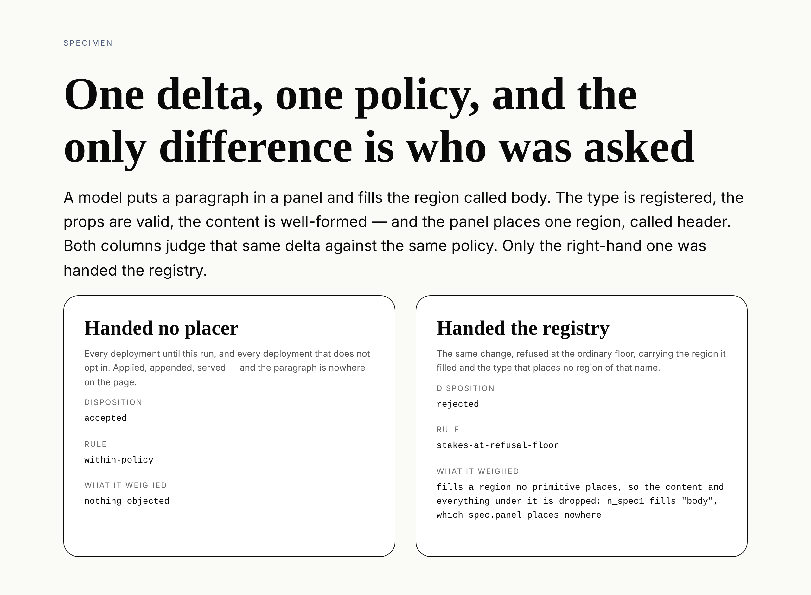

# The vocabularies in one record, and the region the write path now refuses

**Routine:** `Loom daily build` · **Date:** 2026-10-09 · **Section:** §2, the
write path · **Branch:** `framework-61-the-vocabularies-in-one-record` · **PR:** [#566](https://github.com/jam-overture/loom/pull/566)



## What was completed

Two things that had been waiting on each other, done as one unit because
neither was worth doing alone.

**A tree can fill a region its primitive places nowhere.** This morning's run
(0249) made that a render diagnostic — the content and everything under it is
dropped, the page looks finished, and now `slot-unplaced` says so. The write
path still accepted the delta that created one. Every other seam of this shape
has both halves: `data-unread` is reported by the renderer and refused by the
write path, so that what one reports is by construction what the other declines
to write. A dropped region had one half. It has both now.

**`analyzeDelta` was at the end of its parameter shape.** Four optional
trailing vocabularies, with `assessChange` carrying two of them positionally
behind `inverseDeltaId`. The function's own comment had predicted each of the
last three arriving to find the shape at its limit, and had written down the
condition for fixing it: *the run that collects them is the run that can also
rewrite the transcripts*. That condition is exactly why 0249 declined to build
the twin. A fifth vocabulary was the thing that made the collection worth its
cross-lane cost, and the collection was the thing that let the fifth exist.

The picture above is the change, run for real. Both columns judge one delta
against one policy — a model puts a paragraph in a panel's `body`, and the panel
places `header`. Nothing in either column is typed into the specimen: both call
`assessChange` and `gate`, the two functions the composition runtime calls, and
draw what comes back.

| | handed no placer | handed the registry |
| --- | --- | --- |
| disposition | `accepted` | `rejected` |
| rule | `within-policy` | `stakes-at-refusal-floor` |
| what it weighed | nothing objected | `fills a region no primitive places, so the content and everything under it is dropped: n_spec1 fills "body", which spec.panel places nowhere` |

The left column is every deployment until this run and every deployment that
does not opt in. The right is the same delta with one object handed to the
composition root.

### The pieces

- **`src/runtime/vocabulary.ts`** — `unplacedSlotsIn(node, places)` beside
  `unreadBindingsIn`, over `SlotPlacer`: the renderer's own seam, which an SDK
  registry satisfies already. `NOTHING_PLACED` is the silent default and
  `describeUnplacedSlot` is the sentence a refusal carries.
- **`src/runtime/analysis.ts`** — `ChangeVocabulary`, the five vocabularies as
  one optional record, and `ChangeAnalysis.unplacedSlots`, measured on both
  trees and keyed by node **and** name.
- **`src/runtime/stakes.ts`** — `unplaced-slot`, fixed at `critical`.
- **`src/runtime/checks.ts`** — `regions`, the third `WriteCheck`, so wiring the
  seam is recorded on every judgment it makes.
- **`src/runtime/assessment.ts`** — `assessChange` takes `WriteCheckSeams`
  itself, which makes what it passes to the analysis and what it records as
  wired one fact read twice rather than two that agree.
- **`src/runtime/pipeline.ts`** — `slotPlacer?: SlotPlacer` on
  `CompositionRuntime`.
- **`tools/specimen/unplaced-slot.specimen.ts`** — the sheet above, the sibling
  of `unread-binding.specimen.ts`.

## Decisions that were not specified, and why

**`critical`, which is `unread-binding`'s level.** Its argument carries with one
word changed: the repair is one string and the registry holds it, so a refusal
is the one disposition that can tell a repairer what to write instead, where a
confirmation puts a change to a person whose only sensible answer is no. It is
the stronger case rather than the weaker — a question nothing reads costs a
round trip and draws an empty state; a region nothing places costs the author's
paragraph and everything under it.

**Measured on both trees, and keyed by node and name.** A `move` can carry a
region under a parent that places no such region, which is the case
`unknownPrimitives` has no analogue of: a type is fixed when a node is inserted,
and a region's fate belongs to its parent. The key follows `unreadBindings`
rather than `invalidProps` because a node that drops two regions has dropped two
pieces of content.

**The member names in `ChangeVocabulary` are the parameters' own.** A caller
that passed them positionally reaches the same answers by writing down which one
it meant. Renaming them in the same change would have made a mechanical diff
into a judgement call at every call site.

**Each member is `?: X | undefined` rather than optional alone.** Under
`exactOptionalPropertyTypes`, for `WriteCheckSeams`' stated reason: a caller
holding an `X | undefined` at an optional seam is the ordinary case —
`assessChange` is one — and making it rebuild the record to say so would put the
presence test in two places.

**The specimen rather than a screenshot of a page.** There is no screen in this
change. The sheet beside `unread-binding`'s is the form this lane's evidence
already takes for a write-path refusal, and it photographs the claim rather than
illustrating it.

## Records

- **Added: [0250](../decisions/0250-the-write-path-refuses-a-region-nothing-places-and-the-vocabularies-arrive-as-one-record.md)**
  — *The write path refuses a region nothing places, and the vocabularies arrive
  as one record.* `Accepted`: it contradicts no `Accepted` record, touches
  neither the tree schema nor the delta model, and is the step 0249 named and
  declined to take.
- **Maintained, not superseded: 0198.** Two counts in its table moved from
  *fourteen* to *fifteen*, with a dated note beside the one 0208 left. Nothing
  it decides has changed, and `src/record-claims.test.ts` is red until the prose
  agrees with the list in `src/`.
- Nothing superseded.

## Findings

**Closed, both mine:**

- *30 September — `analyzeDelta` is at the end of its parameter shape, and
  collecting them means editing two lesson transcripts.* It was four
  transcripts rather than two in the end, plus two that print the shapes.
- *9 October — a region nobody places is now reported at render and still
  written without complaint.* Its ask to `Loom lessons` is withdrawn rather than
  answered: the transcripts were edited here.

**Filed:** one, for `Loom lessons`, `Loom portal` and `Loom marketing` — the
seven files outside my lane this forced, what moved in each, and the two clauses
written in their voice that they should review. It also records a prose count in
lesson 34 that had been wrong since 0208 and is now right by accident, which is
the half a count registry cannot reach.

## Cross-lane edits, declared

Nine files outside `src/`, every one of them forced by a test rather than
chosen. They are listed in the finding above with what forced each. The two that
are judgement rather than mechanism are the plain-language clauses in the portal
and marketing tables; both are marked in the source with the record that forced
them, which is the convention 0208 set.

## Open questions

1. **This changes the shape of two published signatures.** The package is
   `0.1.0` and pre-production, every caller in this repository is updated, and a
   caller outside it gets a compile error with the compiler pointing at the one
   line. I took that as acceptable rather than as something to version around.
   If it is not, the answer is not to revert the shape — it is to decide what
   this package's compatibility promise is, which nothing states today.
2. **`unplaced-slot` is `critical` and therefore a refusal at the default
   floor.** The honest case against is the author who fills a region a primitive
   will place next week. That change is refusable today on the same ground
   `unread-binding` is — the content is on the floor now and the primitive that
   would place it is not — and a host that disagrees hands no placer. Worth
   knowing the trade was made rather than overlooked.
3. **Nothing wires the placer yet.** `CompositionRuntime.slotPlacer` is absent
   by default, so no deployment in this repository has changed behaviour. The
   portal is the first composition root that would hand its registry over, and
   that is its call rather than mine.

## Test numbers

`pnpm install && pnpm verify`, green, with the gate's status written to a file
and read in a separate command:

```
Test Files  199 passed (199)      Tests  4490 passed (4490)    # root
Test Files  419 passed (419)      Tests  7637 passed (7637)    # @loom/app
EXIT=0
```

12,127 tests across 618 files. Nothing was skipped, nothing was weakened, and
no test was deleted. The suite was red three times on the way and each failure
was a check doing its job rather than something to work around:

- `src/documentation.test.ts` refused two doc comments that made a record number
  part of a sentence — the maintainer's rule on the API reference. Both were
  rewritten as parentheticals.
- `apps/loom/app/(lessons)/_lib/claims.test.ts` reported **zero** sightings of a
  phrase pinned at three, because `NUMBER_WORDS` stopped at `"fourteen"` and a
  match whose captured word is not a number word is skipped. The same list in
  `src/record-claims.test.ts` had the same ceiling. Both gained `"fifteen"`.
- `app/(portal)/_lib/vocabulary.test.ts` caught the word *wrote* in the clause I
  wrote for its table, which is that lane's rule that a factor is conditional
  even for an applied change. It was right and the clause was reworded.

New tests: 15 for the analysis field in `src/runtime/analysis.test.ts`, 9 for
the walk in `src/runtime/vocabulary.test.ts`, 3 for the stake factor in
`src/runtime/stakes.test.ts`, and the `regions` seam through
`src/runtime/checks.test.ts`, whose helpers now take the seams record.
