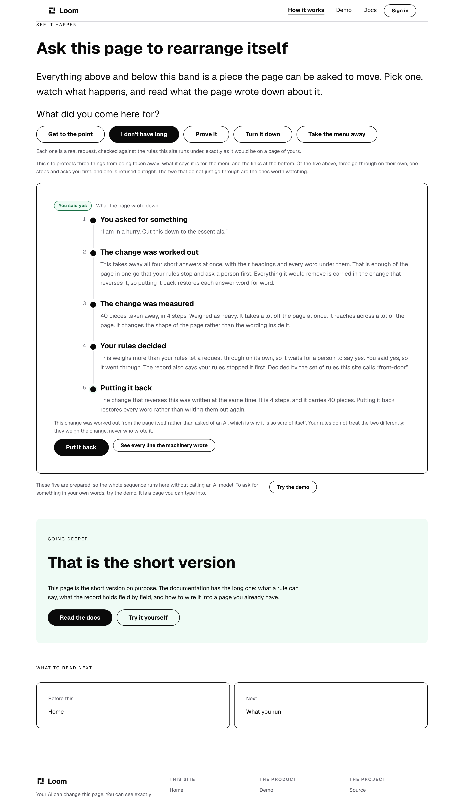
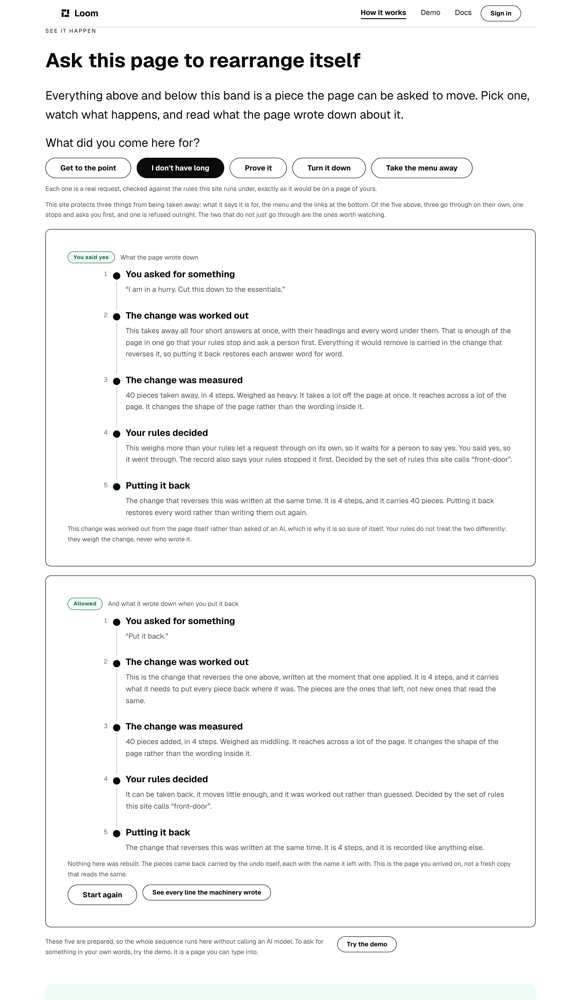

# The control that did nothing

**Lane:** `Loom marketing` · `apps/loom/app/(marketing)/` · **Branch:**
`marketing-64-the-control-that-does-nothing` · **Section:** §4d

## What this run did

Open `/how-it-works`, press **I don't have long**, say yes to the hold, then
press **Put it back**. Until today the page reloaded and came back exactly as it
was. The undo never ran, the record never grew its second entry, and the button
was a link to the page you were already on.

It had been that way for eight days, since the maintainer moved the five choices
off the front door on 1 October. The band moved; two of the four parameters it
reads did not.

This run fixed it, and gave the reading of an address the same single owner the
writing of one has had since August.

## The defect, measured on `main` before anything changed

A production build of `main`, served over HTTP. The framework's own payload
echoes the query string back, so it is stripped and what is hashed is the
document a reader is sent:

```
/how-it-works?ask=shorter&approve=1                   b013a23ca488   97,596 bytes
/how-it-works?ask=shorter&approve=1&back=1            b013a23ca488   97,596
/how-it-works?ask=shorter&approve=1&back=1&back-yes=1 b013a23ca488   97,596
/how-it-works?ask=problem                             be521df904c9  104,263
/how-it-works?ask=problem&back=1                      be521df904c9  104,263
```

Byte for byte the same page. Two sentences written for the states behind that
button could not be reached from any address at all — `RESTORED`, which is the
claim the whole band argues towards:

> *"Nothing here was rebuilt. The pieces came back carried by the undo itself,
> each with the name it left with."*

and `STILL_THERE`, whose own comment in `see-it-happen.ts` introduces it as
*"what the same slot says when the rules stopped the undo, which they do."*

## Why nothing was red

`askedHref` is the one function that writes an address of this site, and its
header says why it is one function:

> *"Two pages read those parameters and they have to read the same ones the same
> way, because one links to the other carrying them. Written twice they would be
> two spellings of one convention."*

**The writing was unified and the reading was not.** Each route parsed the query
string by hand, and the copy that travelled with the band on 1 October carried
`ask` and `approve` and left `back` and `back-yes` behind.

| | the route that reads `back` | the route that needs it |
| --- | --- | --- |
| before 1 October | `/` | `/` |
| after | `/` | **`/how-it-works`** |

Every test of the undo builds a `SitePageContext` itself and asserts against the
tree that comes back. That is the right test of the machinery and it is blind to
the step in front of it. `served.ts` sweeps `back` and `backApprove` across
every state this site can be served in — into a context it fills in itself. So
the parameter was being asserted about by name, in this route group, on the day
it stopped working.

It is the same shape as the five pages that stopped unfurling a share card in
September, which `share.ts` records as *what was tested was the machinery rather
than the pages*. The answer then was one factory plus `announced.test.ts`, which
imports the route modules and calls them. That answer was applied to
`generateMetadata` and not to the other export.

## What shipped

**One reader, beside the one writer.** `_lib/addressed.ts` exports `askedFor`,
and all three routes call it. `ADDRESS_PARAMS` in `site.ts` holds the five
spellings that `askedHref` writes and `askedFor` reads, so a page cannot write
`back` and read `back-yes` again.

**It reads the whole address, not the parameters a page happens to use.** That
is the judgement in this change and it is deliberate: *which half of an address
is worth reading* is exactly what went stale when the band moved, and a route
reading a parameter it has no use for costs nothing, because `pageTreeFor` runs
a request for the page carrying the band and for no other.

Three small corrections came with it. A repeated parameter now takes its first
value, which is already `readThemeName`'s rule and `readAskId`'s and was not the
answers'. The three answers are dropped from an address with no choice in it, in
one place rather than three. And the front door's own header no longer claims to
be the page a request rearranges, because it has not been since 1 October.

## What it looks like

`?ask=shorter&approve=1` and the same address with `&back=1`, at 1280 wide. The
left-hand picture is **also what the right-hand address gave on `main`** — the
md5s above are the proof that the two were one picture.

| the change, said yes to | and put back |
| --- | --- |
|  |  |
| one entry, ending in *Put it back* | two entries, the second the undo's own |

[the same thing at 390](2026-10-09-marketing-undo-after-phone.png) ·
[on `bold` at 1280](2026-10-09-marketing-undo-after-bold-wide.png)

`1280 / 1280` and `390 / 390` on every shot, no overflow. The band grows from
1,332px to 2,069px when the second entry arrives, which is why the two wide
shots are taken in a 2,200px-tall window rather than the named `wide` one: the
subject is a record with two entries in it and a 900px viewport holds one.
Per [0236](../decisions/0236-a-viewport-names-a-device-and-the-pointer-is-part-of-it.md)
that window has a mouse, which is correct for what it is — a desktop screen,
photographed taller than a desktop screen is.

The second card is the thing nobody could see. It is the undo's own record:
*"Put it back."* asked, 40 pieces added in 4 steps, weighed as middling, allowed
by the same named rules that held the change, and the restoration sentence under
it.

## Tests

`addressed.test.ts`, **139 tests, one new file**, in the node project, importing
the three route modules and calling them. `next/headers` is stubbed empty, which
is the one thing a route needs that is not its address and a case
`servedOrigin` already answers by falling back to `siteOrigin()`.

| | what it holds |
| --- | --- |
| the five spellings | written out by hand, not read off the record both halves use |
| the round trip | every address this site can write, read back and written again, identical |
| **the sweep** | for every state in `ASK_STATES`, **the markup each route sends is the markup this lane's library produces for that address**, byte for byte |
| the defect | `&back=1` changes the page, adds the undo's entry, prints the restoration |
| the other two pages | serve the same markup asked or not, and the mechanism page does not |

The sweep is the one that matters. It is not *does this page contain the word* —
it is the whole document, compared against what the library says that address
should produce, with the route doing the reading.

### Four planted defects

| plant | tests red |
| --- | --- |
| the mechanism route reads two of the four parameters again (the defect itself) | **13** |
| `back-yes` misspelled in the record both halves read | 1 |
| a yes is any value rather than `1` | 1 |
| the three answers are kept on an address with no choice | 1 |

The second plant is the one the file was shaped around. `askedHref` and
`askedFor` both take the name from `ADDRESS_PARAMS`, so a misspelling there is a
misspelling in both halves and **every round trip stays green on it**. That is
this lane's own 8 October finding — *a test that interpolates the constant it is
meant to pin is green on any misspelling* — so the five spellings are typed out
once by hand, and that one assertion is the whole of what catches it.

## The numbers

Read off `verify.exit` in its own command, per `docs/routines.md`. `pnpm install
&& pnpm verify` from a deleted `dist` and `.next` — **exit 0**.

| | `main` | this branch |
| --- | --- | --- |
| `@jam-overture/loom` | 195 files / 4,334 | **195 / 4,334** — `src/` untouched |
| `@loom/app` | 412 / 7,385 | **413 / 7,524**, 0 skipped |
| `prerender:check` | — | 128 pages, **1,586 junctions, 0 run together**; 3 metadata conventions, 0 unserved |
| findings | 1,074 | **1,077**, 0 malformed |
| `pnpm shoot` | — | `1280 / 1280`, `390 / 390` — no overflow |

`main`'s app figures are this branch's less the one new file, which is exact
because no existing test file was opened: the whole diff outside the new pair is
three routes and one module. `src/` was not touched at all —
`git diff --name-only -- src` is empty, and the package's two totals came back
byte-identical.

**+139 tests in 1 new file. Nothing weakened, skipped or deleted, and no existing
assertion changed.** No copy was added, so no ceiling in `budget.test.ts` moved
and the word count did not move. The prerender figures are up on the 8 October
report's — 126 pages and 1,584 junctions then, 128 and 1,586 now — from work
that landed on `main` between, not from anything here.

Scope: six files under `apps/loom/app/(marketing)/` — two new, three routes and
one library module — plus `FINDINGS.md`, this report, a shot list and four
photographs.

No decision record. This sets no prop, adds no primitive, and touches neither
the tree schema, the delta model nor an `Accepted` record.

## Findings

**Filed, three.** All in this lane's own file except where noted.

- *The control the whole band argues towards did nothing for eight days* —
  **closed** for this lane by this branch, and filed because the shape is not
  this lane's alone. Eleven `page.tsx` files under `(portal)` read
  `searchParams`; the other three surfaces read none. It is not a claim about
  any of the eleven, which would be this lane reading another lane's code. It is
  one cheap question with a bad answer here, and the instrument is three lines.
- *The card for a rearranged address is drawn by the page that no longer
  rearranges* — **open, mine.** The same move, seen from the other side.
  Measured through the route modules:

  | address | the title it unfurls as |
  | --- | --- |
  | `/?ask=shorter&approve=1` | *"I am in a hurry. Cut this down to the essentials."* |
  | `/how-it-works?ask=shorter&approve=1` | *"How it works — Loom"* |

  Not taken here, because it changes what every shared link of this site says,
  including ones already sent, and because a `drop-pitch` address would unfurl
  as a refusal — the most interesting card this site could draw and the one a
  stranger meets with no context. That is a judgement about what the site says,
  and it wants its own run and its own screenshot.
- *No undo on this site is held, and the shape that would hold one is a setting
  rather than a move* — **open, mine**, re-measuring the 1 October entry. That
  entry stands, and its remedy was wrong for a reason worth writing down: it
  looked only at moves. `analysis.ts` adds the configured node's **own** type to
  the touched set, so configuring a protected node is `high`, and the inverse of
  a configure is a configure on the same node — **so the undo is held on
  identical grounds.** The request is already expressible: `loom.nav` takes
  `position: "static" | "sticky"` and this site's bar is sticky, so *"the menu
  follows me down the page, stop it sticking to the top"* is held, lands on a
  yes, and is held again when you put it back. It pairs with `drop-pitch`, which
  asks to remove the same node and is refused outright. One node, two requests,
  two different answers. It is the recommended next unit for this lane, and it
  is what finally prints `STILL_THERE`.

**Nothing closed from another lane.** The hero finding of 28 September —
*the front door's first control is below the fold on a phone* — is **eleven days
open** and still owned by `Loom primitives`. Not re-measured this run: no copy
changed and no band moved, so the number cannot have.

## Open questions

Positioning, audience, pricing and licensing are the maintainer's, and this run
needed none of them: **it added no copy.** One question that is his, in
`## Needs your input` on the pull request, and it is the share-card finding
above — whether the page that rearranges should be the page whose links unfurl
as the request that rearranged it.
