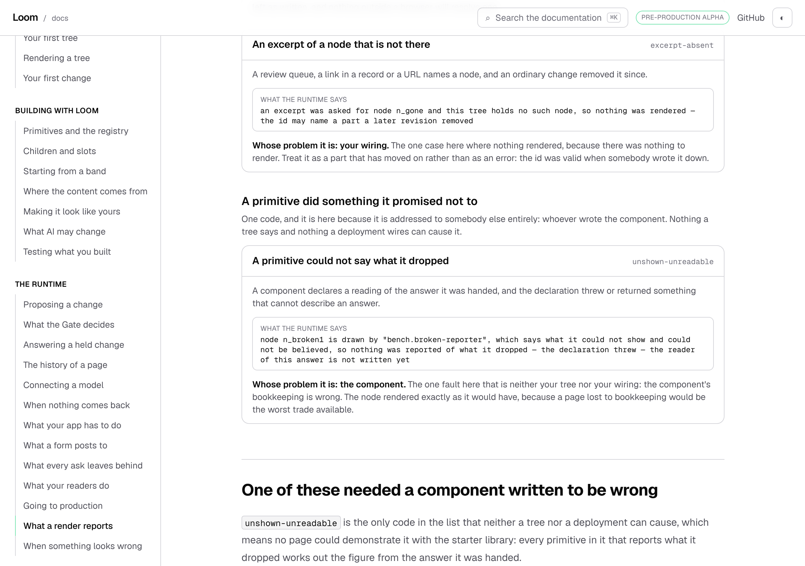
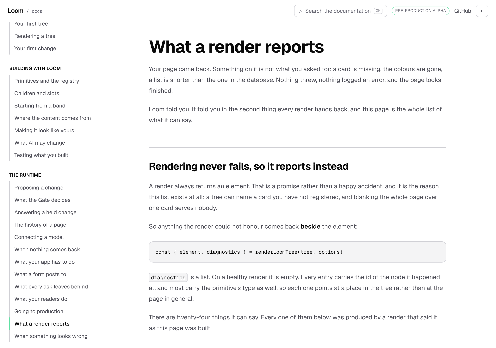
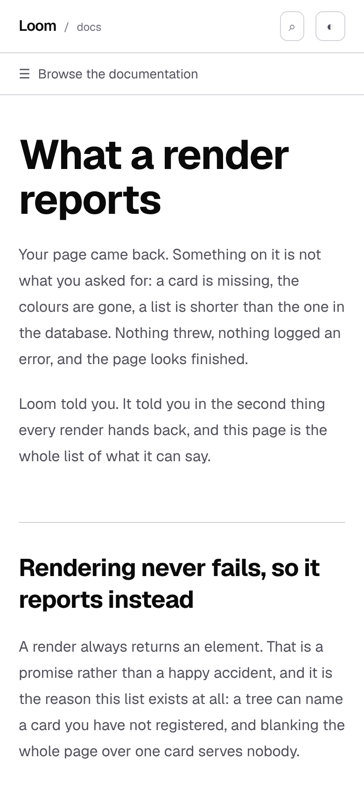
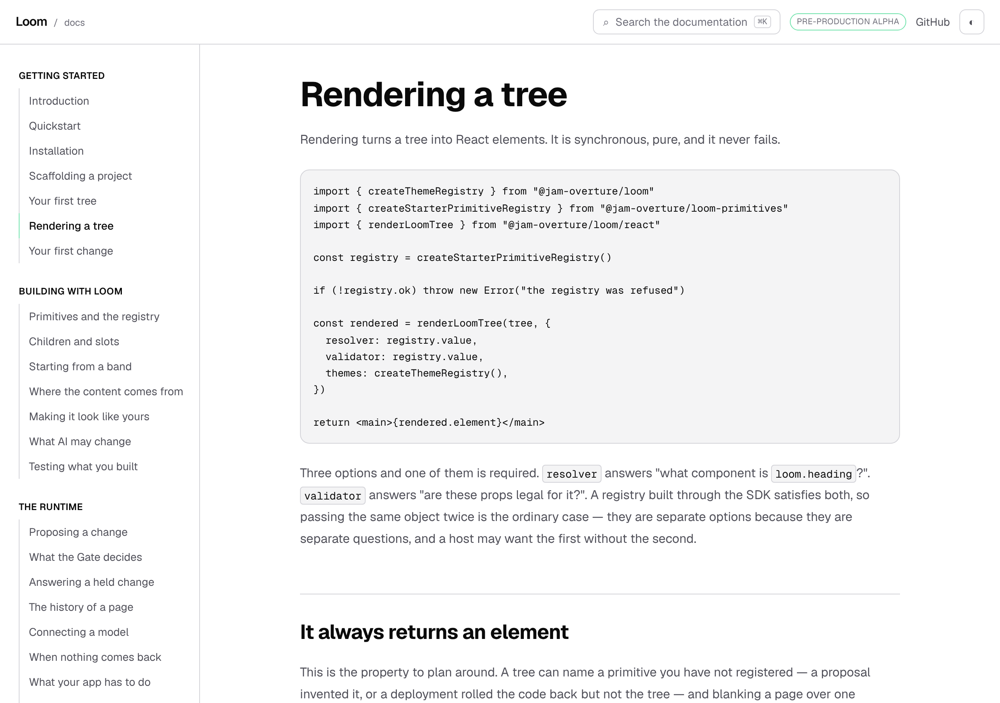

# 10 October 2026 — what a render reports, and the four the site thought there were

**Routine:** `Loom docs` · **Branch:** `docs-51-what-a-render-reports` ·
**Section:** §4c

No open pull request from this lane at the start of the run, and no maintainer
comments outstanding anywhere. Fresh branch off `main` at `e8047d0`.

One thing to note about the clone before anything else: `main` in this session
pointed at `6686895` (#525) while `origin/main` was at `e8047d0` (#562), so the
first branch came off a tree thirty-seven pull requests old. `git fetch origin
main` and a re-branch off `origin/main` fixed it, and it is written down here
because the symptom is silent — the branch builds, the tests pass, and the
merge is a wall of conflicts in files this lane never opened.

## What this run is

A new page, **What a render reports**, in *The runtime*, between *Going to
production* and *When something looks wrong*. It is the complete list of what a
render can tell you it could not honour, and every entry on it was produced by
a render that told it.

## The measurement that chose the page

*Rendering a tree* has carried this table since the page was written:

| Code | What happened |
| --- | --- |
| `unknown-primitive` | the tree named a type the resolver does not have |
| `invalid-props` | props failed the primitive's schema |
| `props-undeclared` | the resolver knows the type and the validator does not |
| `theme-unresolved` | the root named a theme the registry refused |

`RenderDiagnostic` has **twenty-four** members. The table is four of them, it
was four of however-many on the day it was typed, and nothing anywhere could
have said so — it is markdown, and markdown does not fail.

This is the defect §4c names in its own brief, one level down from where the
brief names it. *The API reference is generated from the published entry
points, not written*, because a hand-maintained reference drifts within a week.
A hand-typed table of a runtime union is the same thing in a smaller box, and
the four that were in it were not even the four a reader meets first: a reader
building a page meets `data-unresolved` long before they meet
`props-undeclared`, which needs a deployment to have wired two seams
differently on purpose.

## How the page is built

`_lib/reporting/catalogue.ts` is a `Record<RenderDiagnostic["code"], Recipe>`.
Each recipe is **a real render** — a tree, a registry, and whatever wiring the
fault needs — and the sentence printed beside each row is
`describeRenderDiagnostic`'s, called on the diagnostic that render actually
produced.

Two things make it hold, and both are `_lib/write/endings.ts`'s, which did this
for the seven ways a write can end:

- The `Record` is keyed by the union, so a twenty-fifth diagnostic in the
  runtime is **a type error in this file**.
- Every recipe asserts the render reported the code it is filed under. A recipe
  that stops reaching its fault stops `next build` rather than printing a
  confident sentence under the wrong heading.

`RENDER_DIAGNOSTIC_ORDER` lives in a file of its own with no benches in it,
because `counts.ts` wants the length and nothing else, and a site count that
opened two registries and a broken component to measure something would be
paying for a number with a side effect.

**The portal got here first.** `(portal)/_lib/vocabulary.ts` keeps five
`Record<Union, PlainState>` tables for exactly this reason. What is new here is
not the technique; it is that each row is produced rather than described.

## Who has to fix it, which is the organising idea

The codes do not say whose problem they are, and it is the first thing a reader
wants. The runtime's own doc comments say it in almost these words —
*"a composition-root fault rather than anything the tree did"*,
*"addressed to whoever wrote the component"*,
*"this one is addressed to whoever wrote the tree"* — so the page groups them
that way and the grouping is the one claim on it that is the site's rather than
the runtime's.

| group | codes | what it means |
| --- | --- | --- |
| the tree | 11 | a node asks for something the registry does not back up |
| your wiring | 12 | the tree is fine and a seam is missing something |
| the component | 1 | a primitive broke a declaration it made |

The eleven are the ones a proposal can cause, which is the sentence that
connects this page to *What AI may change*: a policy exists to bound exactly
that column.

## Two things the writing turned up

Both are filed, both are measurements.

**The unresolved-theme sentence is 284 characters and 172 of them are a list of
every palette the deployment registered.** Next longest in the union is 226,
median 144. It grows with the deployment rather than with the runtime, so a
host with a palette per brand gets a paragraph in every log line. Three
defensible answers and one of them is the status quo, which is why it is a
finding rather than a patch. Nothing was trimmed on the page: a site that
shortened the machine's wording to fit its own cards would be inventing a
shorter runtime.

**`unshown-unreadable` cannot be produced by any registered primitive.** It is
the one code only a component can cause, and the five starter primitives that
declare what they could not show all get it right. So this run wrote an
eleven-line component that throws, called `bench.broken-reporter`, registered it
nowhere a reader can reach, and gave the page a section saying what it is. The
finding asks the framework lane for one published stand-in beside
`undecoratedPrimitive`; it does not ask urgently, and "eleven lines per lane is
cheaper than an export" is a fine answer to it.

## Decisions taken that were not specified

- **The page is in *The runtime*, not *Getting started*.** A reader meets
  diagnostics on their first render, and *Rendering a tree* still introduces
  them. What this page is, is the thing you come back to holding a code, and
  that is reference rather than teaching.
- **Four rows stay on *Rendering a tree*, and they are now rendered from the
  catalogue.** The introduction is better for showing a couple in full than for
  linking away, and the point of the run is that those four cannot drift from
  the twenty-four. `NamedDiagnostics` throws on a code the catalogue does not
  have, so a retired code stops the build rather than leaving three plausible
  rows behind.
- **Cards rather than a table**, which the palette sentence above decided. A
  table sized for a 308-character cell is one wide column and five thin ones on
  a 390px screen.
- **`data-unresolved` replaces `props-undeclared` in the four.** The old four
  were chosen as a sample; these four are the ones a reader hits while building.
- **The count is registered.** `<Count of="render-diagnostics" />`, read off
  `RENDER_DIAGNOSTIC_ORDER`, with the recipes' own key set as its second
  opinion in `counts.test.ts`. Both pages render the number rather than typing
  it, which is what the sweep is for.
- **No rendered `<Example>` on it.** The page's subject is what comes back
  beside an element, not an element. Its equivalent of a live example is that
  all twenty-four of its rows are executed as the page builds.

## Records

None added, none superseded. Nothing here touches the tree schema, the delta
model or an `Accepted` record. The page describes behaviour settled by 0049,
0051, 0058, 0063, 0065, 0095, 0164, 0176 and 0206, and copies none of them.

## Findings

Two filed, both on 10 October, both owned by `Loom daily build`:

- **the unresolved-theme sentence grows with the deployment** —
  `src/theme/registry.ts`, nothing blocked, three answers offered.
- **no published stand-in for a primitive that breaks its own declaration** —
  `src/testing/primitives.ts`, nothing asked urgently.

One closed, and it is this lane's own: **the 22 August entry saying the site's
search holds no body text**. It was closed by #512 in early October, which added
`_lib/search/prose.ts`, and the status line still read *open* when this run read
the queue looking for work. The close says so, because a finding whose owner is
the lane that fixes it has no second reader and nothing fails when the status
goes stale. It is the second time this lane has done it.

## Test numbers

`pnpm install && pnpm verify`, green.

| | files | tests |
| --- | --- | --- |
| framework (`src/`, `tools/`) | 199 | 4,465 |
| application (four surfaces) | 421 | 7,657 |

Nothing skipped, nothing weakened, no test marked `todo` or `only`.

**The application's count is up 21 on this branch, in two new test files**, and
that figure is exact rather than estimated: no existing test file gained or lost
a case. `counts.test.ts` was edited, and only inside assertions that already
existed — one row in `SECOND_OPINION`, one line in the spelled-out list, one
`expect` in the block that states the sizes out loud.

- `_lib/reporting/catalogue.test.ts` — **14**, over the twenty-four renders:
  that the reading order is the recipes' key set, that each row's sentence is
  the runtime's, that the three audiences partition the list and stay
  contiguous, and nine over the individual rows whose wording the two pages
  quote.
- `_components/render-diagnostics.test.tsx` — **7**, over the block's printing.
  Same shape as this lane's 2 October finding: a produced block whose producer
  is tested and whose printing nothing looked at.

`pnpm findings:check` reads 1,096 findings, 0 malformed. `pnpm prerender:check`
reads 130 prerendered pages and 1,749 text junctions, 0 run together.

## What the pictures say

Four shots, `pnpm shoot --serve apps/loom`, build stamped
`2026-10-10T14:18:56.128Z`.

| | 1280×900 | 390×844 |
| --- | --- | --- |
| page | `scrollWidth 1280 / innerWidth 1280` | `scrollWidth 390 / innerWidth 390` |
| the catalogue | `768×6274`, 24 cards in 3 groups | 24 cards at `350` wide |
| the longest machine sentence | `290×128` on the phone, four lines | |

The catalogue is 6,274px tall at 1280, which is a long page and is the right
shape for this one: it is read by arriving at it with a code, and both routes in
— the search box and the four on *Rendering a tree* — land a reader at a row
rather than at the top.

## What I would write next

- **A worked example of a primitive of your own, tested.** Carried from
  9 October. *Testing what you built* says *use your own tree and your own
  registry when the thing you are testing is your primitive*, and then does not
  show one. It is short and it is the first thing somebody will look for.
- **The `undefined` half of *The bar above your page*.** Carried from 7, 8 and
  9 October, and still prose with a test behind it rather than a row a reader
  can see, because no registered palette has an unreadable pair.
- **`data-unshown` deserves a paragraph on *Where the content comes from*.** The
  catalogue is where a reader finds it holding a code; the page about binding
  data is where they would find it before they need to. Not done here because
  this run had already touched two pages.
