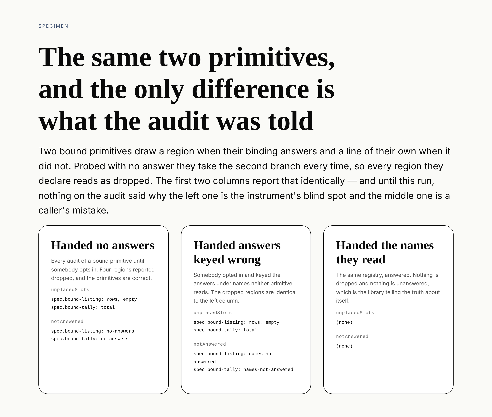

# The answer it was not handed

**Routine:** `Loom daily build` · **Date:** 2026-10-10 · **Section:** §4, the
SDK and the harness · **Branch:** `framework-62-the-answer-it-was-not-handed`



## What was completed

`auditRegistry` now reports the bound primitives it was never put in a position
to see answered. One new list on `RegistryAudit`, `notAnswered`, carrying the
primitive's type, what its registrant declared it reads, and which of two causes
applies.

This closes a finding `Loom primitives` filed on 9 October, and the finding's own
sentence is the best statement of the problem:

> what changed in September was a **permission**, and a permission is the one
> kind of change a suite cannot notice.

0185 widened what a bound primitive is *allowed* to declare, and that permission
sat for sixteen days with nothing taking it up. No instrument could have said so.
`unplacedSlots` is a `some` negated — it reports a declaration nothing drew, and
can never report a rendering nothing declared — so a primitive declaring fewer
regions than it may is invisible, and the audit of the real library went on
passing honestly because nothing ever handed it `answers`.

The fix needed no measurement. The audit is handed the registry, so it knows
which primitives declared `reads`; it is handed the options, so it knows which of
them it holds answers for. The two halves had never been put beside each other.

**The picture above is the whole claim.** One registry of two bound primitives,
audited three times, and the only difference between the columns is what the
caller said. Nothing in any column is typed into the specimen file — each one
calls `auditRegistry` and prints what comes back. The first two columns report
`unplacedSlots` **identically**: four regions dropped, two correct primitives
apparently broken. `notAnswered` is the only line that tells them apart.

## The second cause, which was not asked for

The filing asked for one thing: *bound primitives probed with no answer*. What
shipped reports two causes under one list, and the extra one is the middle column
of the picture.

A host told to make `notAnswered` empty can satisfy a list that only counted
answers by handing an answer keyed under a name the primitive does not read. It
would then get the identical wrong picture — every region reported dropped — with
a clean new instrument telling it the library is at fault. Reporting only the
absence would have rebuilt the blind spot one layer up, in the instrument that
exists to close it.

So `notAnswered` carries `reason`: `no-answers` for a type the call held nothing
for, `names-not-answered` for one it held answers for, none of which carried a
name the primitive resolves to.

## Decisions that were not specified, and why

**The quantifier is the total miss.** A primitive reading two bindings and
answered on one is *not* reported. Reporting a partial miss would make this a
list a host cannot assert empty, which is the exact fault
`ThrowingConfigurations.everyConfiguration` exists to undo elsewhere on this same
type. Conservative, and the conservative direction here is the one that keeps the
list assertable.

**A name answered `unavailable` counts as answered.** The state reaches the
primitive's did-not-answer branch *having been asked*, which is a state the probe
was told about — and it is the one branch 0185 says a bound primitive may place
without an answer. `Object.hasOwn` over the answer's data rather than a
truthiness test on the outcome, deliberately.

**One list with a reason, not two lists.** The remedy for both causes is the same
— hand the audit an answer for that type — and a reader choosing which of two
empty lists to assert is being asked to understand a distinction that does not
change what they do. The `reason` is there for whoever is debugging, in the place
`everyConfiguration` already is.

**It reports; it does not fail.** 0012's charter for this instrument. A host
auditing a registry it assembled from somebody else's package may have no
business knowing what that primitive reads, and an audit that threw would be
unusable to the caller with the least information.

**It is derived from the registration and the options alone.** No probe outcome
reaches the computation, because a probe result cannot make "I was not told" true
or false. This makes `notAnswered` the one entry on `RegistryAudit` that is a
fact about the *call* rather than about a component, and the type comment says so
in as many words.

**`namesRead` is exported rather than reimplemented.** Resolving a prop-named
declaration is the render walk's own rule, in `src/render/reads.ts`, where
`unreadBindings` already used it privately. The probe now asks it of a probe
state's props as the walk asks it of a node's. A second copy would have been two
instruments disagreeing about one declaration.

## Records

- Added **0251** — *The audit reports the bound primitives it was not handed an
  answer for, and being answered under the wrong name is the same report.*
  `Accepted`. Nothing superseded.

`0245` is claimed by #548 and `0250` by #566, both open and unmerged, so `0251`
is the next free number on `main` and on both branches. `pnpm decisions:index`
regenerated and it says the same.

## Findings

**Closed:** the 9 October entry *a discharged permission has no consequence a
suite can watch, unless something takes it up* (`Loom primitives` → `Loom daily
build`, `src/sdk/`). The status names this branch and the record, and declares
the second cause as the one thing shipped that was not asked for.

**Filed:** one entry for `Loom primitives`, on `src/primitives/library.test.ts`.
Their hand-written assertion — *"probes every bound primitive with an answer"* —
is now available as `expect(audit.notAnswered).toEqual([])`, but **theirs is
stronger in one way worth keeping**: it asserts the converse, that without the
answers those four primitives report `unavailable` as unplaced, which is what
gave 0185's permission a consequence in the first place. Dropping it for the
field would lose the half that made the instance catchable. Whether the two
coexist is their call, and the entry says so rather than making it from here.

## Cross-lane edit, declared

One file, generated, forced by a check:
`apps/loom/app/(docs)/_lib/api/reference.generated.json`, regenerated with
`pnpm --filter @loom/app docs:api` and nothing else in that directory touched.
Four new names reach the published surface — `namesRead` through `/react`, and
`UnansweredReader`, `UnansweredReason` and `RegistryAudit.notAnswered` through
`/sdk` — and `extract.test.ts` holds the committed reference against the
generator. The 21 August entry in `FINDINGS.md` records this class and is still
open *for awareness rather than for action*; the drift assertion it asked for is
the check that caught me, so this is that entry working as intended rather than a
new one.

Nothing else outside `src/`, `tools/specimen/`, `decisions/`, `reports/` and
`FINDINGS.md` was touched.

## Four things that went red on the way in, and all four were checks doing their job

**`src/documentation.test.ts`** refused two of my doc comments for making a
decision-record number part of a published sentence — *"either of 0184's forms"*
and *"for the same reason 0010 gives"*. The maintainer's rule, quoted in that
test: *"The casual reader would not know what those are."* Both rewritten so the
number sits in a parenthetical the sentence reads correctly without.

**`tools/decisions/decisions.test.ts`** refused two record links, and the second
was a real error rather than a typo. I had cited **0010** for the audit's
reports-does-not-decide charter, from `audit.ts`'s own header, which cites 0010
for `notDecorated`. 0010 is *Edit mode decorates; it never invents DOM*. The
charter is **0012**, *Conformance is probed and reported, never enforced by
registration*. Corrected in the record, in `audit.ts` and in `FINDINGS.md`.

**`app/(docs)/_lib/api/extract.test.ts` and `offered.test.ts`**, together, on
the last round: the committed API reference had moved, and `namesRead` was
*"published and no page on this site mentions it. Something is published that a
reader has no way to find."* Both are the same fact — the reference is the page —
and both are answered by regenerating it, which is what the first test's own
message instructs. Declared above.

That second check is worth a sentence because it asked a question I had not: is
`namesRead` something a host should be able to call? I think yes. It is the rule
for resolving a binding declaration against props, it sits beside
`unreadBindings` which is already published through the same door, and a host
writing its own diagnostics over bindings wants exactly it. The alternative was
keeping it private and letting `audit.ts` reconstruct the answer out of
`unreadBindings` and two array lengths, which is the same rule written twice and
worse both times.

One more, caught by my own test rather than the suite: an assertion that
`describeRegistryAudit`'s output for an unbound primitive does not contain
`"reads"`. It does — *sp**reads** loom.editable*. The exact `toBe` beside it
already proved the point, so the loose assertion went.

## Test numbers

`pnpm install && pnpm verify` green, status written to a file and read in a
separate command.

```
Test Files  199 passed (199)      Tests  4482 passed (4482)    # root
Test Files  419 passed (419)      Tests  7636 passed (7636)    # @loom/app
EXIT=0
```

12,118 tests across 618 files.

Nothing skipped, nothing weakened, no test deleted.

The new tests are 17: 12 in `src/sdk/audit.test.ts` under *auditRegistry, on
what it was not told*, and 5 in `src/render/reads.test.ts` for the extracted
`namesRead`. They cover both declaration forms, both causes, the total-miss
quantifier, an `unavailable` answer, a prop-named declaration resolved against a
state's own props, the per-type keying, and the three shapes of the description
line.

## Open questions

**The audit knows a *name* was answered; it does not know the answer reached the
branch a caller hoped for.** Hand it `ready` with an empty list where a primitive
needs rows and you get a correct audit of a state you did not mean to probe —
`notAnswered` empty, `unplacedSlots` naming the rows region. This specimen hit it
on the first shot: the right-hand column read `spec.bound-listing: empty` until I
declared both states the listing draws. Closing it means the probe knowing what
*shape* each binding takes, which is 0185's deferred alternative and a larger
question. Stated in the record and in the filing, not closed.

**Two lists on `RegistryAudit` now carry a reason or a flag rather than being
bare arrays of types** — `throwsOnDeclaredProps` and this one. A third would be
the point at which an audit entry wants a common form rather than three bespoke
ones. Not yet, and worth watching.

**Should `library.test.ts` keep its hand assertion?** `Loom primitives`', filed
rather than answered. My view is that it should keep the converse and may drop
the positive half, but that file is theirs and the reasoning is in the entry.
